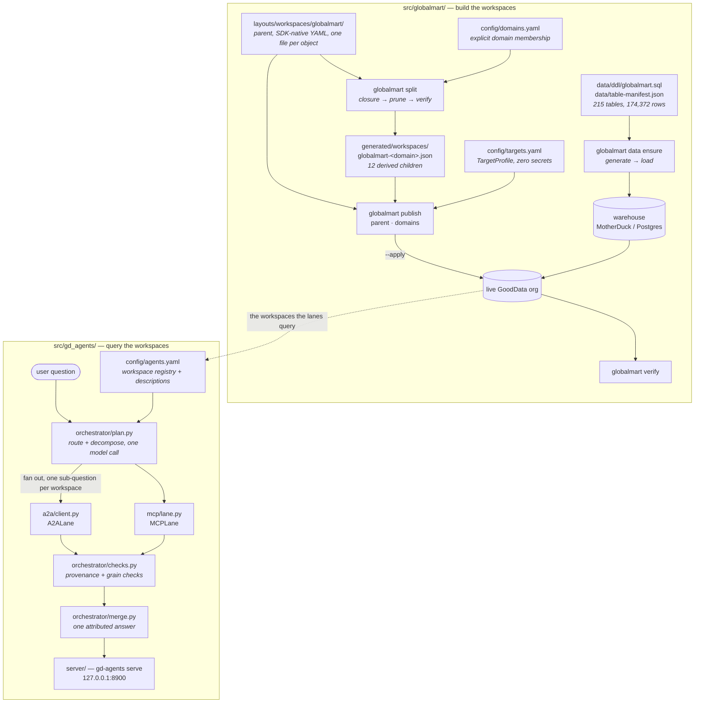

# GlobalMart

A complete GoodData retail analytics estate — warehouse rows, logical data model, 1091 metrics,
384 visualizations, 32 dashboards and the AI context on top — defined as code and rebuildable into
any org from a clean clone.

**The repo is the source of truth, never a live org.** Nothing here requires reading a live
workspace to rebuild GlobalMart. Two packages, two jobs: `src/globalmart/` builds the workspaces,
`src/gd_agents/` talks to them.

[Vision](specs/VISION.md) · [Feature registry](specs/REGISTRY.md) ·
[Steering constraints](specs/STEERING.md) · [Interface contract](specs/CONTRACT.md)

## Why it exists

- **[goal-01](specs/goals/goal-01.md) — rebuildable from source into any domain.** A clean clone
  plus credentials for an empty org rebuilds the parent workspace and all 12 domain workspaces,
  every visualization executing, no manual step.
- **[goal-02](specs/goals/goal-02.md) — A2A and MCP shown to be implementable over it.** The 12
  domain workspaces each have their own pruned model and metric vocabulary, so choosing between
  them is a real semantic routing decision — which makes them the proving ground for an
  orchestrator that federates across workspaces it does not own.

## How it fits together



## Map of the repo

| Path | What | Committed? |
|---|---|---|
| [`layouts/workspaces/globalmart/`](layouts/workspaces/globalmart) | Parent workspace, SDK-native YAML, one file per object. No org id in the path | yes |
| [`generated/workspaces/`](generated/workspaces) | The 12 derived children, declarative JSON. Derived, never authored — fix the parent and regenerate | yes ([ADR 003](specs/decisions/003-generated-artifacts-committed-vs-regenerated.md)) |
| [`data/`](data) | `ddl/globalmart.sql` (215 tables) and `table-manifest.json`. The rows themselves are generated on demand, not stored | DDL + manifest yes; rows no ([ADR 008](specs/decisions/008-data-generated-not-committed.md)) |
| [`config/`](config) | `targets.yaml` (publish targets, zero secrets), `domains.yaml` (domain membership), `agents.yaml` (orchestrator registry), corpus manifests | yes |
| [`src/globalmart/`](src/globalmart) | Capture, normalize, split, publish, verify, data generation, knowledge compilation | yes |
| [`src/gd_agents/`](src/gd_agents) | The A2A/MCP orchestrator: registry, router, lanes, merge checks, viewer | yes |
| [`docs/`](docs) | How each part works, and what was measured | yes |
| [`specs/`](specs) | Vision, goals, steering, the interface contract, ADRs, per-feature specs | yes |
| [`tests/`](tests), [`scripts/`](scripts) | Test suite and one-shot utilities | yes |
| `backups/`, `reports/` | Runtime output | no |

## Rebuild GlobalMart into an org

```bash
uv sync --extra data

# 1. Credentials: a profile in config/targets.yaml, its token in the environment.
#    Tokens are env-only and never live in YAML.
export GLOBALMART_TOKEN__DEMO_CLOUD=...
globalmart targets inspect --target demo-cloud     # org id + datasources, read from the host

# 2. Check the committed artifacts before touching anything remote.
globalmart data verify                              # DDL agrees with the SQL datasets
globalmart split --check                            # generated/workspaces is current
globalmart domains validate --strict                # every dashboard lands in a domain

# 3. The whole chain — rehearsal first. Without --apply nothing is written to the org.
globalmart rebuild --target demo-cloud
globalmart rebuild --target demo-cloud --apply
```

`rebuild` is the four steps run in order; break it open when a step needs attention:

```bash
globalmart data ensure   --target demo-cloud --apply   # generate rows, load the warehouse
globalmart publish parent  --target demo-cloud --apply # the parent workspace
globalmart split                                       # derive the 12 children
globalmart publish domains --target demo-cloud --apply # publish them
globalmart verify --target demo-cloud                  # execute every visualization
```

`--apply` gates every write to a live org; `--dry-run` belongs to commands whose writes are local
files, and no command has both. Details: [publish targets](docs/publish-targets.md) ·
[verification](docs/verification.md) · [the data](docs/data-custody.md) ·
[the domain split](docs/domain-split.md).

## Run the orchestrator

One GoodData agent is scoped to one workspace. Every customer with more than one hits that wall, so
`gd-agents` federates: route the question, fan out to the workspaces that can answer it, merge one
attributed answer. Same questions run over A2A or MCP, which is how the two are compared rather
than argued about.

```bash
uv sync --extra agents
export GLOBALMART_TOKEN__DEMO_CLOUD=...
export ANTHROPIC_API_KEY=...

# 1. Describe the workspaces for the router, by querying them.
gd-agents profile --host https://<org>.cloud.gooddata.com \
  --workspaces globalmart-customer,globalmart-marketing,globalmart-store-ops,globalmart-ecommerce \
  --apply                                   # writes config/agents.yaml

gd-agents registry                          # what the router sees

# 2. Score routing alone — no lane called, so it is cheap.
gd-agents route --script config/questions.yaml

# 3. Ask for real. 30–120s for a two-lane question: the lanes are live agents, not a cache.
gd-agents ask "which regions grew fastest last quarter, and did marketing spend follow?"
gd-agents ask "..." --protocol mcp          # same question, other protocol

# 4. Watch a turn happen.
gd-agents serve                             # http://127.0.0.1:8900
```

`gd-agents rehearse` replays the scripted conversations end to end against the live agents;
`mcp-probe` and `mcp-tools` measure what a workspace's MCP endpoint offers. The design and the
measured results are in [A2A federation](docs/a2a-federation.md); what an orchestrator still needs
from GoodData is in [the gap list](docs/a2a-gaps.md).

## Read next

| Doc | What it covers |
|---|---|
| [a2a-federation.md](docs/a2a-federation.md) | The orchestrator's design, and what it measured |
| [a2a-gaps.md](docs/a2a-gaps.md) | What a third-party orchestrator needs from GoodData, and what is missing |
| [mcp-findings.md](docs/mcp-findings.md) | What the MCP endpoint offers, and what it costs |
| [domain-split.md](docs/domain-split.md) | How a child is derived: closure, the pull-in rule, LDM pruning |
| [domains.md](docs/domains.md) | The `config/domains.yaml` manifest, field by field |
| [publish-targets.md](docs/publish-targets.md) | Adding a target, and what publishing rewrites |
| [verification.md](docs/verification.md) | The cold-rebuild proof and the failure taxonomy |
| [data-custody.md](docs/data-custody.md) | Where the rows come from and how they are checked |
| [knowledge.md](docs/knowledge.md) | AI memory items and the knowledge corpus |
| [bootstrap-provenance.md](docs/bootstrap-provenance.md) | What the parent workspace contained at capture |
